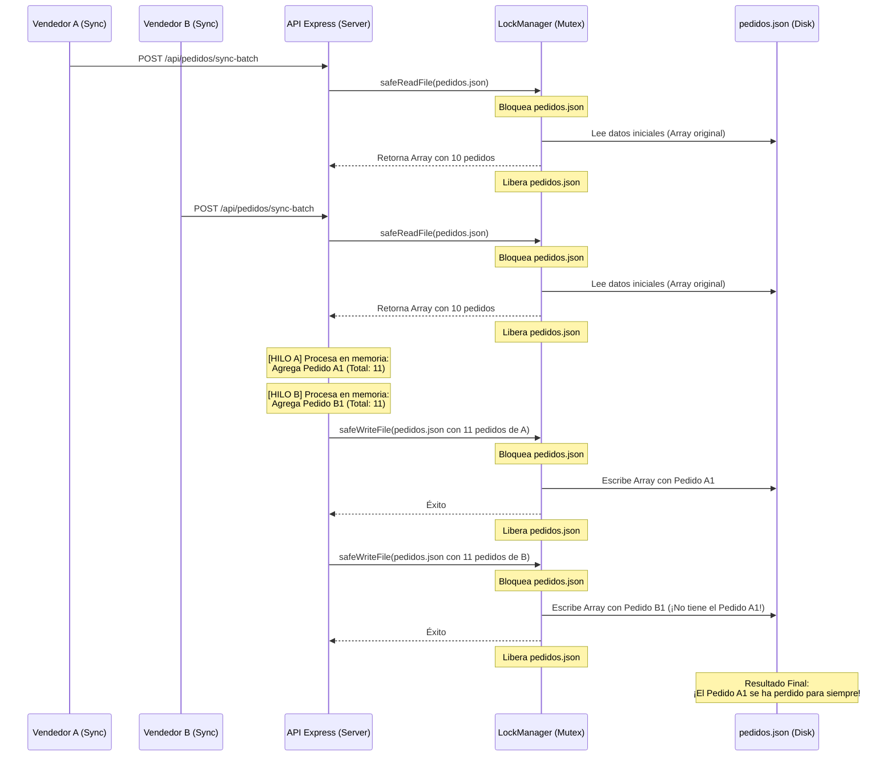

# Plan de Producción: Análisis de Integridad y Guía de Migración a NAS
## ARARE S.A.S. - Sistema de Toma de Pedidos

Este documento contiene un análisis técnico exhaustivo del estado actual del sistema, enfocado en la integridad de los datos (arquitectura JSON), consejos de mejora y una guía detallada para migrar el sistema desde la PC de desarrollo a una **NAS corporativa** en ejecución 24/7 utilizando **Docker** y **Cloudflare Tunnels**.

---

## 1. Análisis de Integridad de Datos (Carga y Persistencia en JSON)

El sistema utiliza archivos planos JSON en la carpeta [db_json](file:///c:/Users/luisf/OneDrive/Desktop/TOMA%20PEDIDO/db_json) como su motor de base de datos central. Aunque en las últimas actualizaciones se incorporó un sistema de validación con **Zod** ([validationSchemas.ts](file:///c:/Users/luisf/OneDrive/Desktop/TOMA%20PEDIDO/backend/schemas/validationSchemas.ts)) y un gestor de exclusión mutua en memoria llamado `lockManager` ([lockService.ts](file:///c:/Users/luisf/OneDrive/Desktop/TOMA%20PEDIDO/backend/services/lockService.ts)), persisten fallas estructurales graves de concurrencia y atomicidad que ponen en riesgo la integridad de la información en producción.

### 1.1. La Gran Falla de Concurrencia (Carrera de Lectura/Escritura)

El `lockManager` implementa un semáforo (Mutex) que garantiza que *una función de lectura o escritura de archivo* ocurra sin interrumpirse a nivel de sistema operativo. Sin embargo, **no protege la transacción lógica completa** en los endpoints del servidor, particularmente en [api.ts](file:///c:/Users/luisf/OneDrive/Desktop/TOMA%20PEDIDO/backend/routes/api.ts#L406).

Observemos el flujo cuando dos asesores (Vendedor A y Vendedor B) envían una sincronización al mismo tiempo:



#### ¿Por qué ocurre?
Porque el lock se libera inmediatamente después de la lectura (`safeReadFile`) y solo se vuelve a adquirir al escribir (`safeWriteFile`). El tiempo que transcurre mientras Express procesa la lógica en la memoria de JavaScript queda totalmente desprotegido. Si el Vendedor B lee el archivo antes de que el Vendedor A termine de escribir, los cambios del Vendedor A se sobrescribirán silenciosamente.

---

### 1.2. Falta de Atomicidad (Transacciones ACID)

En un motor de base de datos relacional tradicional (como PostgreSQL o SQLite), si ocurre un error a mitad de una transacción, todos los cambios se cancelan (Rollback). En el sistema actual, la sincronización guarda datos de forma secuencial en archivos independientes:

1. `saveClientes(clientes)` -> Guarda en [clientes.json](file:///c:/Users/luisf/OneDrive/Desktop/TOMA%20PEDIDO/db_json/clientes.json)
2. `saveDeletedPedidos(deleted)` -> Guarda en [deleted_pedidos.json](file:///c:/Users/luisf/OneDrive/Desktop/TOMA%20PEDIDO/db_json/deleted_pedidos.json)
3. `savePedidos(pedidos)` -> Guarda en [pedidos.json](file:///c:/Users/luisf/OneDrive/Desktop/TOMA%20PEDIDO/db_json/pedidos.json)

Si el servidor experimenta una pérdida de energía, se llena el disco duro de la NAS, o el proceso de Node.js se detiene por el monitor PM2 en el paso 2, el archivo `clientes.json` se habrá actualizado pero `pedidos.json` no. Esto generará una **inconsistencia insalvable de base de datos** (clientes creados cuyos pedidos asociados nunca existieron en el servidor).

---

### 1.3. Degradación del Rendimiento y Consumo de Memoria

Cada vez que el backend recibe una petición HTTP para interactuar con datos:
1. Carga archivos de texto que pueden pesar megabytes.
2. Parsea todo el contenido a objetos JavaScript en memoria RAM (`JSON.parse`).
3. Realiza búsquedas y filtrados mediante métodos iterativos de arrays (`find`, `map`, `filter`).
4. Convierte de nuevo todo el set de datos a texto plano (`JSON.stringify`).
5. Escribe por completo el archivo en el almacenamiento físico.

Con un catálogo de miles de referencias y un histórico acumulado de pedidos de todo el año, la NAS sufrirá una alta carga de I/O (lectura/escritura en disco) y consumo de CPU, lo que ralentizará severamente el tiempo de respuesta del sistema y acortará la vida útil de los discos duros de la NAS (especialmente si no son unidades SSD).

---

### 1.4. Limitación ante Escalabilidad (PM2 en Modo Cluster)
Si en el futuro deciden cambiar el archivo [ecosystem.config.cjs](file:///c:/Users/luisf/OneDrive/Desktop/TOMA%20PEDIDO/ecosystem.config.cjs) para correr el backend en modo `cluster` (múltiples instancias del proceso para aprovechar los núcleos de la NAS), el `lockManager` fallará por completo. Al ser un objeto en memoria (`new FileLockManager()`), cada instancia de Node tendrá su propio semáforo aislado y no se enterará de los bloqueos de las demás, corrompiendo los archivos JSON de inmediato.

---

## 2. Solución Recomendada para Integridad de Datos

### Solución a Corto Plazo: Bloqueo a Nivel de Endpoint (Rápido de Implementar)
Para solucionar la pérdida de datos por concurrencia de forma inmediata sin rediseñar el backend, se debe mover la adquisición del Mutex al inicio del procesamiento del endpoint `sync-batch` y mantenerlo activo durante todo el ciclo de lectura, cálculo y escritura.

```typescript
// En backend/routes/api.ts
router.post('/pedidos/sync-batch', authMiddleware, async (req, res) => {
  // Adquirir un bloqueo exclusivo global para toda la sincronización
  await lockManager.runExclusive('GLOBAL_DATABASE_SYNC', async () => {
    const { pedidos, clientes, deletedPedidos } = req.body;
    
    // 1. Leer datos consolidados (usando funciones que no apliquen locks individuales redundantes)
    const data = await getAllData(); 
    
    // 2. Procesar lógica en memoria...
    
    // 3. Escribir todos los archivos
    await saveClientes(clientesMerged);
    await saveDeletedPedidos(finalDeleted);
    await savePedidos(mergedPedidos);
    
    res.json({ ... });
  });
});
```

### Solución Definitiva a Mediano Plazo: Migración a SQLite
Se recomienda encarecidamente migrar de archivos JSON a **SQLite**.
* **¿Por qué SQLite?**
  * Es una base de datos relacional contenida en un único archivo (ej. `arare_pedidos.db`).
  * Admite transacciones ACID reales (si falla la escritura del pedido, se deshace la del cliente).
  * Maneja de forma nativa la concurrencia a nivel de sistema de archivos usando bloqueos de escritura automáticos.
  * No consume RAM mapeando toda la base de datos; solo lee y escribe los registros que se solicitan mediante sentencias SQL.
  * No requiere instalar ningún servidor de base de datos adicional en la NAS.

---

## 3. Guía de Migración y Despliegue en NAS (24/7)

Para garantizar un entorno estable, aislado y fácil de mantener en la NAS, utilizaremos **Docker** y **Docker Compose**. Esto evita tener que configurar dependencias de Node.js, compilar archivos o instalar paquetes directamente en el sistema operativo nativo de la NAS.

### 3.1. Arquitectura de Despliegue en la NAS

```
              ┌──────────────────────────────────────┐
              │      Internet (Red Cloudflare)       │
              └──────────────────┬───────────────────┘
                                 │
                         (Túnel HTTPS Seguro)
                                 │
                                 ▼
              ┌──────────────────────────────────────┐
              │          NAS de la Empresa           │
              │                                      │
              │  ┌────────────────────────────────┐  │
              │  │      Red Interna Docker        │  │
              │  │                                │  │
              │  │  ┌──────────────┐              │  │
              │  │  │  Container   │              │  │
              │  │  │ cloudflared  │              │  │
              │  │  └──────┬───────┘              │  │
              │  │         │ (HTTP local)         │  │
              │  │         ▼                      │  │
              │  │  ┌──────────────┐              │  │
              │  │  │  Container   │              │  │
              │  │  │   Backend    │              │  │
              │  │  │  (Port 5050) │              │  │
              │  │  └──────┬───────┘              │  │
              │  └─────────┼──────────────────────┘  │
              │            │                         │
              │    (Volúmenes Montados)              │
              │            ▼                         │
              │  ┌────────────────────────────────┐  │
              │  │ Carpeta Compartida NAS         │  │
              │  │ (Ej. /volume1/docker/pedidos)  │  │
              │  │ ├─ db_json/                    │  │
              │  │ └─ fotos_referencias/          │  │
              │  └────────────────────────────────┘  │
              └──────────────────────────────────────┘
```

---

### 3.2. Paso 1: Preparar la Carpeta en la NAS
1. Inicia sesión en la interfaz de administración de tu NAS (ej. Synology DSM).
2. Abre el **File Station** y crea una carpeta destinada al proyecto bajo el directorio docker, por ejemplo: `/volume1/docker/toma-pedidos/`.
3. Crea dos subcarpetas dentro de esta ruta:
   * `/volume1/docker/toma-pedidos/db_json`
   * `/volume1/docker/toma-pedidos/fotos_referencias`
4. Copia tus archivos `.json` de base de datos actuales a la subcarpeta `db_json` recién creada.
5. Copia tus fotos de catálogo a la subcarpeta `fotos_referencias`.

---

### 3.3. Paso 2: Crear el Archivo Dockerfile (Para Compilar el Backend)
En la raíz del proyecto, debes crear un archivo llamado `Dockerfile` (sin extensión) para indicarle a Docker cómo empaquetar el servidor backend.

```dockerfile
# Dockerfile
FROM node:20-alpine AS builder

WORKDIR /app

# Copiar configuración de dependencias
COPY package*.json ./

# Instalar dependencias de desarrollo y producción
RUN npm install

# Copiar todo el código fuente
COPY . .

# Compilar el frontend (genera la carpeta dist)
RUN npm run build

# Compilar el backend (genera el archivo server.js)
RUN npx esbuild server.ts --bundle --platform=node --format=esm --outfile=server.js --packages=external

# --- Etapa de Producción ---
FROM node:20-alpine

WORKDIR /app

COPY package*.json ./
# Instalar solo dependencias de producción para mantener la imagen ligera
RUN npm ci --omit=dev

# Copiar el backend compilado y los recursos del frontend
COPY --from=builder /app/server.js ./server.js
COPY --from=builder /app/dist ./dist

# Variables de entorno por defecto
ENV NODE_ENV=production
ENV PORT=5050

EXPOSE 5050

CMD ["node", "server.js"]
```

---

### 3.4. Paso 3: Crear el Archivo docker-compose.yml
El archivo `docker-compose.yml` gestiona la ejecución coordinada del servidor Express y del conector de Cloudflare. Créalo en la raíz del proyecto:

```yaml
version: '3.8'

services:
  backend:
    build:
      context: .
      dockerfile: Dockerfile
    container_name: toma-pedidos-backend
    restart: always
    ports:
      - "5050:5050"
    environment:
      - NODE_ENV=production
      - PORT=5050
      - JWT_SECRET=arare_produccion_token_secreto_2026 # ¡Cambia esto por una clave segura!
    volumes:
      # Montar las carpetas de datos de la NAS dentro del contenedor para persistencia real
      - /volume1/docker/toma-pedidos/db_json:/app/db_json
      - /volume1/docker/toma-pedidos/fotos_referencias:/app/public/fotos_referencias

  cloudflare-tunnel:
    image: cloudflare/cloudflared:latest
    container_name: toma-pedidos-tunnel
    restart: always
    command: tunnel --no-autoupdate run
    environment:
      # Pega el token del túnel de Cloudflare aquí
      - TUNNEL_TOKEN=TU_TOKEN_DE_SEGURIDAD_DE_CLOUDFLARE_AQUI
    depends_on:
      - backend
```

---

### 3.5. Paso 4: Configurar y Modificar el Túnel de Cloudflare

Para trasladar el túnel que estaba en la PC del desarrollador a la NAS:

1. **Desactivar el túnel local en la PC de desarrollo**:
   * Abre los Servicios de Windows (`services.msc`).
   * Busca el servicio `cloudflared`.
   * Detén el servicio y cámbialo a tipo de inicio **Deshabilitado** para evitar colisiones.

2. **Obtener el Token del Túnel**:
   * Ve al panel de [Cloudflare Zero Trust](https://dash.cloudflare.com/).
   * Entra a **Networks** -> **Tunnels**.
   * Identifica el túnel creado para este proyecto. Haz clic en **Configure**.
   * Verás las opciones de instalación para Docker. Copia el token de seguridad que aparece al final del comando de Docker. Lucirá similar a un string largo de caracteres alfanuméricos.
   * Pega este token en la línea `TUNNEL_TOKEN=...` dentro de tu archivo `docker-compose.yml`.

3. **Modificar el Public Hostname en Cloudflare**:
   * En la misma interfaz de edición de tu Túnel en Cloudflare, ve a la pestaña **Public Hostname**.
   * Haz clic en **Edit** sobre la ruta de tu subdominio (ej. `api-pedidos.tuempresa.com`).
   * **¡Importante!** Cambia la URL del servicio. Como ahora corre dentro de la red interna de Docker, ya no debe apuntar a `localhost:5050`. Debe configurarse de la siguiente manera:
     * **Type**: `HTTP`
     * **URL**: `backend:5050` (Docker mapea el nombre del servicio `backend` automáticamente como la dirección IP local del contenedor).
   * Guarda los cambios en Cloudflare.

---

### 3.6. Paso 5: Desplegar en la NAS
Puedes desplegar este ecosistema en la NAS de dos maneras:

#### Método A: A través de la Interfaz Web de Synology (Container Manager)
1. Instala el paquete **Container Manager** desde el Centro de Paquetes de Synology.
2. Abre **Container Manager** -> **Proyecto** -> **Crear**.
3. Dale un nombre al proyecto (ej. `toma-pedidos`).
4. Selecciona la ruta de la carpeta compartida en la NAS (`/volume1/docker/toma-pedidos`).
5. En la sección de configuración de origen, selecciona **Crear docker-compose.yml** y pega el contenido del archivo detallado en el paso 3.4.
6. Copia los archivos `Dockerfile` y `package.json` en esa misma carpeta.
7. Sigue el asistente, presiona **Finalizar** y Container Manager descargará las imágenes, compilará el código y encenderá los servicios automáticamente en segundo plano.

#### Método B: A través de Terminal SSH (Para administradores de TI)
1. Habilita SSH en el panel de control de tu NAS.
2. Conéctate a la NAS mediante consola (ej. PuTTY o terminal de macOS/Linux):
   ```bash
   ssh tu_usuario_nas@ip_de_la_nas
   ```
3. Navega a la carpeta del proyecto:
   ```bash
   cd /volume1/docker/toma-pedidos
   ```
4. Ejecuta el levantamiento de los contenedores en segundo plano (modo daemon):
   ```bash
   sudo docker-compose up -d --build
   ```
5. Esto construirá la imagen del frontend/backend a partir del `Dockerfile` y arrancará el túnel de Cloudflare 24/7.

---

## 4. Consejos de Seguridad y Mantenimiento para Producción

1. **Gestión de Backups**:
   * Las NAS Synology cuentan con la herramienta **Hyper Backup**. Configura una tarea diaria de Hyper Backup para respaldar la carpeta `/volume1/docker/toma-pedidos/db_json` en la nube (Synology C2, Google Drive, OneDrive) o en un disco duro externo.
   * Dado que se usan archivos JSON, un backup es tan simple como copiar los archivos de texto, haciéndolo sumamente fácil de recuperar.

2. **Rotación del Secreto JWT**:
   * Modifica el valor de `JWT_SECRET` en el archivo `docker-compose.yml` a una frase compleja. No dejes la clave por defecto. Si el secreto se expone, cualquiera podría generar tokens de soporte y alterar los pedidos del servidor.

3. **Restricción de Recursos en Docker**:
   * Si la NAS es de gama de entrada (poca memoria RAM), añade límites de recursos en el bloque del backend en tu `docker-compose.yml` para evitar que consuma toda la memoria de la NAS si hay un bucle infinito:
     ```yaml
     deploy:
       resources:
         limits:
           cpus: '0.50'
           memory: 512M
     ```

4. **Monitoreo de Logs**:
   * En caso de errores o reclamos de sincronización de los asesores, puedes inspeccionar los logs en tiempo real directamente en la aplicación Container Manager de la NAS (sección Contenedor -> Detalles -> Registro) o vía SSH ejecutando:
     ```bash
     sudo docker logs -f toma-pedidos-backend
     ```

---

## 5. Resumen del Roadmap para un Entorno de Producción Robusto

| Fase | Tarea | Dificultad | Beneficio |
| :--- | :--- | :---: | :--- |
| **Inmediato** | Modificar endpoint `/api/pedidos/sync-batch` agregando un lock a nivel transaccional en [api.ts](file:///c:/Users/luisf/OneDrive/Desktop/TOMA%20PEDIDO/backend/routes/api.ts). | Baja | Evita pérdida de pedidos por sincronización simultánea de vendedores. |
| **Despliegue** | Crear `Dockerfile`, `docker-compose.yml` y migrar túnel de Cloudflare a la NAS. | Media | Ejecución 24/7 sin dependencia de la PC de desarrollo. |
| **Corto Plazo** | Configurar respaldos automáticos diarios de la carpeta `db_json` de la NAS. | Baja | Recuperación de desastres rápida y confiable. |
| **Mediano Plazo**| Migrar el almacenamiento de datos del backend de archivos JSON a **SQLite**. | Media-Alta | Eliminación total de problemas de concurrencia, transacciones ACID nativas y alto desempeño I/O. |
