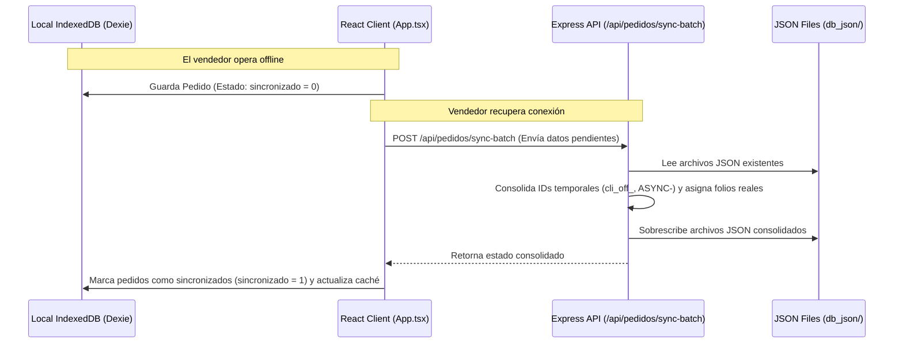

# Análisis de Seguridad, Arquitectura y Código - Sistema de Toma de Pedidos (ARARE S.A.S.)

Este documento contiene un análisis técnico detallado sobre el estado actual del **Sistema de Toma de Pedidos** de ARARE S.A.S. El objetivo es identificar riesgos críticos de seguridad de la información, evaluar el manejo de datos, señalar áreas de mejora de código y proporcionar una hoja de ruta para optimizar el sistema.

---

## 1. Propósito del Sistema y Arquitectura

El sistema es una aplicación **Offline-First** diseñada para que los asesores de ventas de ARARE S.A.S. registren pedidos y gestionen clientes en zonas con conectividad inestable.

### Componentes de la Arquitectura
1. **Frontend (Cliente SPA):** React 19 + TypeScript + Vite. Configurado como una **PWA (Progressive Web App)** con Service Workers para funcionar sin conexión.
2. **Base de Datos Local (IndexedDB):** Gestionada a través de **Dexie.js**. Almacena de forma temporal o persistente en el dispositivo del vendedor: clientes, prendas de catálogo, campañas y pedidos creados sin sincronizar.
3. **Backend (Servidor API):** Servidor Express en Node.js que expone endpoints REST para sincronizar datos bidireccionalmente.
4. **Base de Datos Central (Archivos JSON):** Ubicada en la carpeta `db_json/`. Los datos consolidados se guardan directamente en archivos plano JSON (`pedidos.json`, `clientes.json`, `usuarios.json`, etc.).

---

## 2. Flujo de Información y Sincronización



---

## 3. Análisis Crítico de Seguridad de la Información

Se han identificado múltiples vulnerabilidades de seguridad de nivel **CRÍTICO** y **ALTO** que deben corregirse prioritariamente si el sistema se expone a internet.

### 🚩 Riesgo 1: Validación de Claves en el Cliente (Frontend) - CRÍTICO
* **Descripción:** La validación de credenciales se realiza **en el navegador del cliente**. El frontend descarga la base de datos completa de usuarios (`usuarios.json`) al iniciar la aplicación a través del endpoint `/api/data` y busca allí el usuario y la clave ingresada.
* **Impacto:** Cualquier atacante o usuario malintencionado que tenga acceso a la URL de la aplicación puede abrir la pestaña *Network (Red)* del navegador o usar la herramienta de desarrollo (F12) para ver la lista completa de usuarios con sus claves en texto plano, accediendo a cuentas de soporte o de otros vendedores sin esfuerzo.

### 🚩 Riesgo 2: Almacenamiento de Credenciales en Texto Plano - CRÍTICO
* **Ubicación:** `db_json/usuarios.json` y fallback en `backend/services/dbService.ts` (Línea 92).
* **Descripción:** Las claves (PINs de 4 dígitos) se almacenan de forma legible ("1234", "9999", "1421") tanto en el servidor (archivo JSON) como en la base de datos local del navegador (IndexedDB).
* **Impacto:** Si un dispositivo móvil es sustraído o si un tercero logra acceso no autorizado al servidor, podrá comprometer las cuentas de todos los asesores y de soporte de inmediato, ya que no se aplica ningún algoritmo de hashing (como bcrypt o Argon2).

### 🚩 Riesgo 3: Falta Total de Autenticación y Autorización en la API - CRÍTICO
* **Ubicación:** `backend/routes/api.ts` (Todos los endpoints).
* **Descripción:** Ningún endpoint del backend (`/api/data`, `/api/clientes`, `/api/pedidos`, `/api/usuarios`, etc.) requiere un token de sesión (JWT), cookie de autenticación, o cabecera API Key. 
* **Impacto:** Cualquier persona que conozca la dirección IP o dominio del servidor de backend puede enviar peticiones POST para alterar pedidos de otros asesores, robar datos privados de clientes (nombres, teléfonos, direcciones) o inhabilitar usuarios registrando payloads arbitrarios.

### 🚩 Riesgo 4: Suplantación de Roles sin Verificación - ALTO
* **Ubicación:** `backend/routes/api.ts` (Líneas 140-153 y 343-350).
* **Descripción:** Para operaciones como la eliminación de pedidos, el backend confía en un objeto `user` enviado en el cuerpo de la petición (`req.body`):
  ```typescript
  if (user) {
    if (user.rol === 'soporte') { ... }
  }
  ```
* **Impacto:** Un usuario con rol `general` puede simplemente editar la petición HTTP (usando Postman o la consola del navegador) para autodeclararse con `rol: "soporte"`, evadiendo las restricciones de negocio impuestas por la interfaz visual.

### 🚩 Riesgo 5: Vulnerabilidad ante Fuerza Bruta y Ataques DoS - MEDIO
* **Ubicación:** Servidor Express.
* **Descripción:** 
  - Al usarse PINs de 4 dígitos, un atacante solo requiere probar un máximo de 10,000 combinaciones para vulnerar una cuenta. Al no haber limitación de intentos (*rate limiting*), un script automatizado puede forzar el acceso en pocos segundos.
  - El límite de carga JSON está establecido en un valor excesivo: `app.use(express.json({ limit: '50mb' }))`.
* **Impacto:** Un atacante puede inundar el backend con peticiones pesadas y consumir el almacenamiento en disco o colapsar la memoria del proceso de Node.js, ocasionando denegación de servicio.

---

## 4. Análisis de Concurrencia e Integridad de Datos

El uso de archivos planos JSON para base de datos representa riesgos que afectan directamente la integridad de los pedidos de ARARE S.A.S.

### ⚠️ Concurrencia y Sobrescritura ("Race Conditions")
* **Ubicación:** `backend/services/dbService.ts`.
* **Detalle:** La base de datos lee y escribe con `fs.readFile` y `fs.writeFile`. Cuando múltiples asesores sincronizan pedidos al mismo tiempo:
  1. El Asesor A hace POST `/api/pedidos` (El servidor lee el JSON).
  2. El Asesor B hace POST `/api/pedidos` (El servidor lee el mismo JSON antes de que A termine de guardar).
  3. El Asesor A escribe sus datos en el JSON.
  4. El Asesor B escribe sus datos en el JSON.
* **Resultado:** Los pedidos sincronizados por el Asesor A se perderán o serán destruidos, ya que el proceso del Asesor B sobrescribió el archivo completo basándose en una lectura antigua.

### ⚠️ Falta de Validación y Sanitización de Esquemas de Entrada
* **Detalle:** El backend confía plenamente en que el array enviado por el frontend contiene estructuras correctas. Si por error o malicia se envía un dato nulo o con tipo de dato corrupto, se escribirá en el JSON. Esto romperá la lectura general en el siguiente arranque, deshabilitando el sistema completo para todos los usuarios.

---

## 5. Calidad de Código y Deuda Técnica

Se analizó la base de código frontend y backend para proponer mejoras en arquitectura:

### ⚙️ El Archivo `src/App.tsx` es un Monolito (2,563 líneas)
* **Problema:** Controla simultáneamente:
  - Inicialización de IndexedDB (Dexie).
  - Estado de sesión (Login, logout, cambios de clave).
  - Sincronización y manejo de errores de conexión.
  - Vistas y lógica de pestañas (Dashboard, pedidos, clientes).
  - Modales de configuración (Campañas disponibles, edición de roles, plantilla de Excel).
* **Solución:** Debe modularizarse aplicando patrones modernos de React:
  - Crear un **`AuthContext`** para la sesión y roles.
  - Crear un **`SyncContext`** o un Hook personalizado (`useOfflineSync`) para la sincronización con Dexie.
  - Extraer los modales de configuración y vistas a archivos separados en `src/components`.

### ⚙️ Lógica de Negocio y Fechas Acopladas
* **Problema:** En `src/App.tsx` (Líneas 49-63) y `backend/services/dbService.ts`, el año por defecto (`2026`) está quemado en el código (*hardcoded*), y la lógica de campañas asume reglas manuales restrictivas basadas en los nombres de las campañas.
* **Solución:** Estos parámetros deben ser dinámicos y controlados desde la base de datos o mediante variables de entorno en el archivo `.env`.

### ⚙️ Gestión de Archivos en el Repositorio Git
* **Problema:** El archivo comprimido `TOMA PEDIDO.zip` (aproximadamente 60MB) está en la raíz del proyecto y probablemente se incluyó en el historial de Git.
* **Solución:** Guardar copias de seguridad de esta forma en Git ensucia el historial, ralentiza el clonado y es considerado una mala práctica. Debe eliminarse del seguimiento de Git usando un comando de limpieza de historial y añadirse al `.gitignore`.

---

## 6. Plan de Acción y Hoja de Ruta Sugerida

Se estructuran las mejoras recomendadas en tres fases lógicas, de menor a mayor esfuerzo de desarrollo:

### Fase 1: Correcciones Críticas de Seguridad (Corto Plazo / Urgente)
| Acción | Archivos a Modificar | Descripción |
| :--- | :--- | :--- |
| **Autenticación en el Backend** | `backend/routes/api.ts`, `src/services/apiService.ts` | Implementar un endpoint `/api/auth/login`. La validación del PIN debe ocurrir en el servidor y no en el cliente. |
| **Eliminar usuarios del GET general** | `backend/services/dbService.ts` | Modificar `getAllData()` para que bajo ninguna circunstancia retorne el array de `usuarios` a las vistas del cliente común. |
| **Encriptado de PINs** | `backend/services/dbService.ts`, `backend/routes/api.ts` | Utilizar una librería ligera de hashing (como `bcryptjs`) para almacenar los PINs de los usuarios con formato hash. |
| **Rate Limiter (Prevención de Brute Force)** | `backend/server.ts` | Integrar `express-rate-limit` en la API para limitar a 5 intentos de login fallidos por minuto. |

### Fase 2: Robustez de Datos y Concurrencia (Medio Plazo)
| Acción | Archivos a Modificar | Descripción |
| :--- | :--- | :--- |
| **Migración de Base de Datos** | `backend/services/dbService.ts` | Reemplazar los archivos planos JSON del servidor por un motor relacional embebido como **SQLite** o un gestor de base de datos relacional (PostgreSQL) que asegure transacciones ACID y bloqueos a nivel de registro. |
| **Esquema de Validación** | En endpoints POST | Agregar un middleware de validación como **Zod** o **Joi** para comprobar el esquema de clientes y pedidos antes de insertarlos a la base de datos. |
| **Manejo Seguro de Archivos Temporales** | `backend/services/dbService.ts` | Si se insiste en mantener archivos JSON, implementar una cola de escritura o el uso de bloqueos por archivo (p. ej., con la librería `proper-lockfile`). |

### Fase 3: Refactorización y Buenas Prácticas (Largo Plazo)
| Acción | Archivos a Modificar | Descripción |
| :--- | :--- | :--- |
| **División de `App.tsx`** | `src/App.tsx` | Dividir el componente monolítico en componentes pequeños y encapsular la lógica en React Contexts/Hooks. |
| **Limpieza de Git** | `.gitignore`, Repositorio | Remover archivos zip y dumps innecesarios de la raíz y limpiar el historial de Git para optimizar el tamaño de descarga del repositorio. |
| **Variables de Entorno dinámicas** | `backend/config.ts`, `src/App.tsx` | Pasar configuraciones duras (año por defecto, límites, etc.) a variables de entorno `.env`. |
